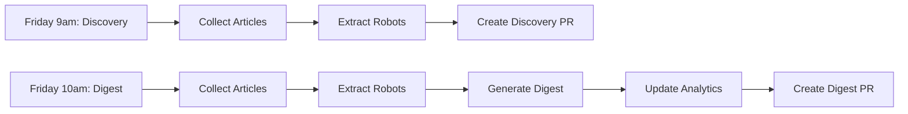

# GitHub Actions Workflows

This document explains the automated workflows configured for the Awesome Robots project.

---

## 📅 Workflow Schedule Overview

| Workflow | Schedule | Purpose | Output |
|----------|----------|---------|--------|
| **Weekly Robot Discovery** | Friday 9:00 AM UTC | Discover new robots | PR with discovery data |
| **Weekly Digest & Analytics** | Friday 10:00 AM UTC | Generate digest & analytics | PR with blog post + analytics |

---

## 🤖 Weekly Robot Discovery

**File**: `.github/workflows/weekly-robot-discovery.yml`
**Schedule**: Every Friday at 9:00 AM UTC
**Duration**: ~2-3 minutes

### What It Does

1. **Collects Articles** (`npm run fetch-articles`)
   - Fetches articles from IEEE TV RSS, Robot Report RSS, arXiv cs.RO
   - No API costs - pure RSS/HTML parsing
   - Saves to `data/collected-articles/YYYY-MM-DD.json`

2. **Extracts Robots** (`npm run extract-robots`)
   - Uses Claude Sonnet 4.5 API to extract robot information
   - Deduplicates against existing catalog
   - Assigns quality scores and confidence ratings
   - Saves to `data/discovered-robots/YYYY-MM-DD.json`
   - **Cost**: ~$0.06 per run

3. **Creates Pull Request**
   - Branches: `discovery/weekly-robots-YYYY-MM-DD`
   - Includes both data files
   - Ready for manual review and robot addition

### Pull Request Contents

The PR includes:
- `data/collected-articles/YYYY-MM-DD.json` - Raw article data
- `data/discovered-robots/YYYY-MM-DD.json` - Extracted robot data
- Quality breakdown (high/medium/low scores)
- Article count from each source

### Next Steps After PR

1. Review discovered robots in the JSON file
2. Research official specifications from manufacturer websites
3. Use Claude Code to add robots to catalog:
   ```bash
   Add the new robots from @data/discovered-robots/YYYY-MM-DD.json
   Note: all images must be downloaded locally, follow @src/components/RobotDetailTemplate.tsx
   ```
4. Merge the discovery PR
5. The robots will be added in a separate commit/PR

### Manual Trigger

You can manually trigger this workflow:
1. Go to GitHub Actions → Weekly Robot Discovery
2. Click "Run workflow"
3. Select branch and click "Run workflow"

---

## 📰 Weekly Digest & Analytics

**File**: `.github/workflows/weekly-robot-fetch.yml`
**Schedule**: Every Friday at 10:00 AM UTC (1 hour after discovery)
**Duration**: ~5-8 minutes

### What It Does

1. **Collects Articles** (`npm run fetch-articles`)
   - Same as discovery workflow
   - Fetches from IEEE TV, Robot Report, arXiv

2. **Extracts Robots** (`npm run extract-robots`)
   - Same as discovery workflow
   - Uses Claude API for extraction
   - **Cost**: ~$0.06 per run

3. **Generates Digest** (`npm run generate-digest`)
   - Creates weekly blog post with insights and trends
   - Uses Claude API for content generation
   - Saves to `content/blog/YYYY-MM-DD-digest-issue-N.md`
   - **Cost**: ~$0.015 per run

4. **Updates Analytics** (`npm run update-analytics`)
   - Aggregates robot catalog statistics
   - Tracks discovery trends over time
   - Updates brand and category distributions
   - No API costs

5. **Creates Pull Request**
   - Branches: `automation/weekly-digest-YYYY-MM-DD`
   - Includes all 4 outputs
   - Ready for editorial review

### Pull Request Contents

The PR includes:
- `data/collected-articles/YYYY-MM-DD.json` - Article data
- `data/discovered-robots/YYYY-MM-DD.json` - Robot discoveries
- `content/blog/YYYY-MM-DD-digest-issue-N.md` - Blog post
- `data/analytics/*.json` - Updated analytics

### Next Steps After PR

1. Review digest blog post for editorial quality
2. Verify discovered robots against official sources
3. Check analytics data integrity
4. Merge to publish the digest
5. Consider adding high-quality discoveries to main catalog

### Manual Trigger

You can manually trigger this workflow:
1. Go to GitHub Actions → Weekly Robot Discovery & Digest Automation
2. Click "Run workflow"
3. Select branch and click "Run workflow"

---

## 💰 Cost Analysis

| Workflow | API Calls | Cost per Run | Annual Cost |
|----------|-----------|--------------|-------------|
| **Discovery** | 1 extraction | ~$0.06 | ~$3.12/year |
| **Digest & Analytics** | 1 extraction + 1 digest | ~$0.075 | ~$3.90/year |
| **Total** | - | ~$0.135/week | ~$7.02/year |

Both workflows share the same article collection and robot extraction, so the incremental cost of the digest workflow is only the digest generation (~$0.015).

---

## 🔧 Configuration

### Required Secrets

Both workflows require:
- `ANTHROPIC_API_KEY` - Set in GitHub Settings → Secrets → Actions

### Environment Variables

No additional environment variables needed. The workflows use:
- `GITHUB_TOKEN` - Automatically provided by GitHub Actions
- `GH_TOKEN` - Alias for GITHUB_TOKEN (for gh CLI)

---

## 🚨 Error Handling

Both workflows will:
1. **Automatic Retry**: Claude API calls retry 3 times with exponential backoff
2. **Failure Issues**: Create GitHub issue with detailed error information
3. **Manual Recovery**: Instructions provided in failure issue

### Common Failure Scenarios

**Article Collection Failed:**
- RSS feeds unavailable
- Network connectivity issues
- Invalid XML/JSON responses

**Robot Extraction Failed:**
- ANTHROPIC_API_KEY not configured
- API rate limits exceeded
- Invalid article data format

**Digest Generation Failed:**
- Insufficient article data
- API errors during generation
- Invalid markdown output

### Manual Recovery

If automation fails, run locally:

```bash
# Set API key
export ANTHROPIC_API_KEY="your-api-key"

# Run individual steps
npm run fetch-articles
npm run extract-robots
npm run generate-digest
npm run update-analytics

# Review outputs
ls -l data/collected-articles/
ls -l data/discovered-robots/
ls -l content/blog/
```

---

## 📊 Workflow Outputs

### Discovery Workflow Output Structure

```
data/
├── collected-articles/
│   └── 2026-01-26.json          # Article data with metadata
└── discovered-robots/
    └── 2026-01-26.json          # Robot discoveries with quality scores
```

### Digest Workflow Output Structure

```
data/
├── collected-articles/
│   └── 2026-01-26.json          # Article data
├── discovered-robots/
│   └── 2026-01-26.json          # Robot discoveries
└── analytics/
    └── *.json                    # Updated analytics data

content/
└── blog/
    └── 2026-01-26-digest-issue-N.md  # Generated blog post
```

---

## 🔄 Workflow Dependencies



**Note**: The two workflows run independently. The digest workflow re-runs article collection and extraction to ensure it has fresh data even if the discovery workflow failed.

---

## 📝 Troubleshooting

### Discovery PR Not Created

**Check:**
1. Workflow completed successfully
2. Articles were collected (check logs)
3. Robots were extracted (check logs)
4. Branch was created and pushed

**Fix:**
- Review workflow run logs in GitHub Actions
- Check ANTHROPIC_API_KEY is configured
- Manually trigger workflow to retry

### Digest PR Missing Content

**Check:**
1. All 4 steps completed (articles, robots, digest, analytics)
2. Digest file was created in `content/blog/`
3. No errors in Claude API calls

**Fix:**
- Review digest generation logs
- Verify article data quality
- Check for API rate limiting

### Both Workflows Failed

**Check:**
1. RSS feeds are accessible
2. GitHub Actions runner has network access
3. Dependencies installed correctly

**Fix:**
- Check GitHub status page
- Review RSS feed availability
- Wait 1 hour and retry

---

## 📬 Newsletter & Distribution

### Beehiiv Newsletter
- **Component**: `src/components/NewsletterSignup.tsx`
- Embeds beehiiv subscription form via iframe
- Available on the site for email newsletter signups

### Discord Newsletter
- **Script**: `scripts/send-weekly-digest-newsletter.ts`
- Automatically sends when a new digest post is pushed to main
- Parses the digest + all daily posts from the last 7 days
- Splits messages to respect Discord's 2000-character limit
- **Workflow**: `.github/workflows/weekly-digest-newsletter.yml`
- **Required secret**: `DISCORD_NEWSLETTER_WEBHOOK_URL`

### Weekly Digest Newsletter Workflow

**File**: `.github/workflows/weekly-digest-newsletter.yml`
**Trigger**: Push to `main` matching `content/blog/awesome-robots-digest-issue-*.md`, or manual `workflow_dispatch`

**What it does:**
1. Detects new digest posts pushed to main
2. Parses the digest and collects daily posts from the last 7 days
3. Sends formatted newsletter to Discord webhook
4. Handles Discord's 2000-character message limit by splitting into chunks

### Claude Code PR Review Workflow

**File**: `.github/workflows/claude-code-review.yml`
**Trigger**: Pull requests (opened, synchronized, ready_for_review, reopened)

**What it does:**
1. Runs automated code review on every PR using `anthropics/claude-code-action@v1`
2. Posts review comments directly on the PR
3. **Required secret**: `CLAUDE_CODE_OAUTH_TOKEN`

---

## 🔗 Data Sources

- **IEEE TV RSS**: https://ieeetv.ieee.org/channel_rss/channel_77/rss
- **The Robot Report RSS**: https://www.therobotreport.com/feed/
- **arXiv cs.RO**: https://arxiv.org/list/cs.RO/new

---

## 🎯 Best Practices

1. **Review PRs Promptly**: Discovery data is time-sensitive
2. **Monitor Costs**: Check Anthropic API usage monthly
3. **Update Secrets**: Rotate ANTHROPIC_API_KEY periodically
4. **Test Locally First**: Before relying on automation, test locally
5. **Keep Documentation Updated**: Update this file when workflows change

---

## 📚 Additional Resources

- **Setup Guide**: `docs/SETUP.md`
- **Placeholder Documentation**: `docs/GITHUB-ACTIONS-PLACEHOLDERS.md`
- **Adding Robots**: `docs/ADDING-ROBOTS.md`
- **SEO Guide**: `docs/SEO.md`

---

**Last Updated**: February 26, 2026
